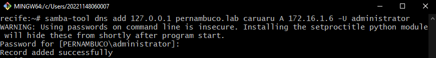
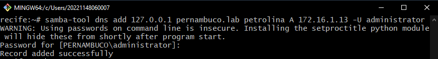
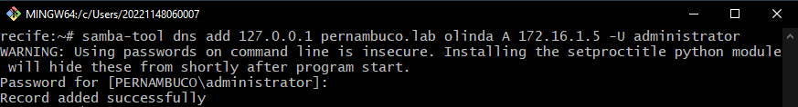
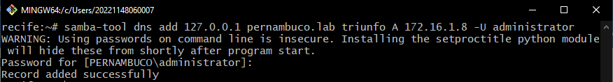
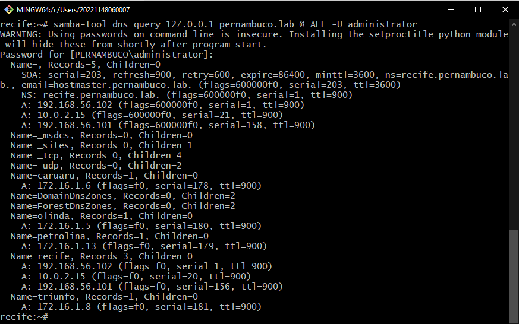

# Registros de Recurso do DNS com `samba-tool`

## Introdução

O DNS (Domain Name System) utiliza vários tipos de registros de recursos para mapear nomes de domínio a endereços IP, serviços, ou outros dados. Nesta documentação, vamos abordar especificamente os registros do tipo A, que associam nomes de domínio a endereços IPv4.

Nesta sessão, foram criados quatro registros DNS do tipo A para as cidades de Caruaru, Petrolina, Olinda e Triunfo, utilizando o comando `samba-tool dns add`.

## Criação de Registros DNS do Tipo A

### Sintaxe do Comando

O comando utilizado para criar registros do tipo A é o seguinte:

```ini
samba-tool dns add <endereço_servidor> <zona_dns> <nome_registro> A <endereço_ip> -U <usuário>
```

- `<endereço_servidor>: O endereço do servidor DNS, que pode ser 127.0.0.1 para o próprio servidor.`
- `<zona_dns>: O domínio ou zona para o qual o registro será adicionado, como pernambuco.lab.`
- `<nome_registro>: O nome do host (no caso, o nome das cidades).`
- `<endereço_ip>: O endereço IP que será associado ao nome.`
- `-U <usuário>: O usuário que está executando o comando (normalmente o administrador do domínio).`

## Exemplos de Criação de Registros

Foram criados quatro registros do tipo A para as cidades de Caruaru, Petrolina, Olinda e Triunfo:

1. Caruaru:



2. Petrolina:



3. Olinda:



4. Triunfo:



Esses comandos criaram os registros DNS que mapeiam os nomes das cidades para o endereço `IP 172.16.1.{pc}.`

## Listagem de Todos os Registros DNS na Zona pernambuco.lab

Após a criação dos registros, foi utilizada a seguinte sintaxe para listar todos os registros DNS existentes na zona `pernambuco.lab:`

```ini
samba-tool dns query 127.0.0.1 pernambuco.lab @ ALL -U administrator
```

Este comando lista todos os registros de todas as classes e tipos na zona DNS especificada, no caso `pernambuco.lab.`

A captura de tela abaixo exibe a listagem de todos os registros DNS na zona pernambuco.lab:



## Conclusão
A criação e gestão de registros de DNS utilizando o `samba-tool` é um processo simples e direto. Esta documentação cobriu a criação de registros do tipo A para quatro cidades e a verificação desses registros com uma consulta completa à zona DNS. As capturas de tela fornecem uma evidência visual do processo realizado.
